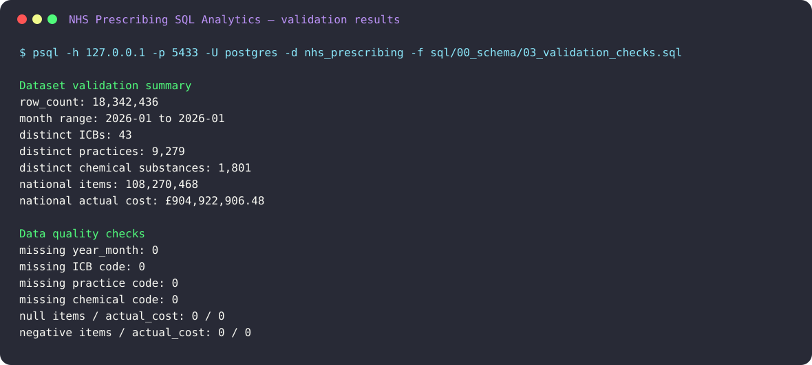
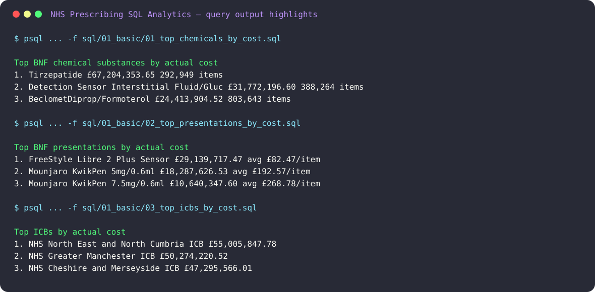

# NHS Prescribing SQL Analytics

## Project Overview

This project analyses public NHS English Prescribing Data using PostgreSQL.

The goal is to explore prescribing cost patterns across England, identify high-cost BNF chemical substances and presentations, compare regional variation across Integrated Care Boards (ICBs), and build reproducible SQL analyses suitable for a healthcare analytics portfolio.

This project combines pharmacy domain knowledge with SQL, PostgreSQL, data analysis, and healthcare data interpretation.

## Key Findings

From the full January 2026 dataset loaded locally into PostgreSQL:

- Tirzepatide was the highest-cost BNF chemical substance by total actual cost, with £67.2m across 292,949 items.
- FreeStyle Libre 2 Plus Sensor was the highest-cost individual presentation, with £29.1m actual cost and an average cost of £82.47 per item.
- The highest total-cost ICBs were large regional systems such as North East and North Cumbria, Greater Manchester, and Cheshire and Merseyside; these rankings should be interpreted alongside prescribing volume and population size.
- High practice-level costs are analytical signals for further investigation, not evidence of poor prescribing quality without adjustment for practice size, demographics, disease burden, case mix, and specialist responsibilities.
- The analysis shows how SQL can identify cost drivers, regional variation, high-unit-cost medicines, and outlier signals in a real healthcare dataset.

## Why This Project Matters

NHS prescribing data contains millions of rows of real-world medicines usage and cost information.

Analysing this data can help answer questions such as:

- Which medicines or product categories drive the highest prescribing costs?
- How does prescribing cost vary between Integrated Care Boards?
- Which GP practices appear to have unusually high cost patterns?
- What is the relationship between prescribing volume, item count, and actual cost?
- Can SQL be used to generate clinically relevant and operationally useful healthcare insights?

The project is designed as a portfolio piece demonstrating practical SQL skills on a large real-world healthcare dataset.

## Tools Used

- PostgreSQL
- Docker / local PostgreSQL container
- SQL
- psql
- Git and GitHub
- CSV / text-based outputs

## Repository Structure

```text
nhs-prescribing-sql-analytics/
├── README.md
├── .gitignore
├── data/
│   └── .gitkeep
├── sample_data/
│   └── prescribing_jan_2026_sample.csv
├── scripts/
│   └── run_all_queries.sh
├── sql/
│   ├── 00_schema/
│   │   ├── schema.sql
│   │   ├── load_data.sql
│   │   ├── 02_indexes.sql
│   │   └── 03_validation_checks.sql
│   ├── 01_basic/
│   │   ├── 01_top_chemicals_by_cost.sql
│   │   ├── 02_top_presentations_by_cost.sql
│   │   ├── 03_top_icbs_by_cost.sql
│   │   └── 04_highest_cost_per_item.sql
│   ├── 02_intermediate/
│   │   ├── 01_top_chemicals_per_icb.sql
│   │   ├── 02_high_cost_practices.sql
│   │   └── 03_cost_per_item_by_chemical.sql
│   └── 03_advanced/
│       ├── 01_icb_rankings_window_functions.sql
│       └── 02_practice_cost_outliers.sql
├── outputs/
│   ├── 00_validation_checks.txt
│   └── analysis output text files
├── screenshots/
│   ├── validation_results.svg
│   └── key_findings_outputs.svg
└── docs/
```

## Data Source

This project uses public NHSBSA Open Data.

- Dataset: English Prescribing Dataset (EPD) with SNOMED Code
- Publisher: NHS Business Services Authority (NHSBSA)
- File used: English Prescribing Dataset (EPD) with SNOMED code - Jan 2026
- Local filename: `data/prescribing_jan_2026.csv`
- Official source: https://opendata.nhsbsa.net/dataset/english-prescribing-dataset-epd-with-snomed-code

The raw CSV is not committed to this repository because it is several GB in size.

For this project, the full local CSV was approximately 7.2 GB and loaded into PostgreSQL as:

```text
raw_prescribing_jan_2026
```

The successful local load imported:

```text
18,342,436 rows
```

## Sample Data

A small sample file is included to make the repository easier to inspect without downloading the full dataset:

```text
sample_data/prescribing_jan_2026_sample.csv
```

This sample contains:

```text
10,001 lines
1 header row + 10,000 data rows
```

The sample is intended for quick structure review and lightweight testing only. The main analysis outputs were generated from the full January 2026 dataset.

## Database Setup

The recommended PostgreSQL connection command used in this project is:

```bash
psql -h 127.0.0.1 -p 5433 -U postgres -d nhs_prescribing
```

The project was developed against a local PostgreSQL database exposed on host port 5433.

To start the local PostgreSQL container defined in `docker-compose.yml`:

```bash
docker compose up -d
```

To create the schema:

```bash
psql -h 127.0.0.1 -p 5433 -U postgres -d nhs_prescribing -f sql/00_schema/schema.sql
```

To load the full raw CSV:

```bash
psql -h 127.0.0.1 -p 5433 -U postgres -d nhs_prescribing -f sql/00_schema/load_data.sql
```

To create recommended indexes and update planner statistics:

```bash
psql -h 127.0.0.1 -p 5433 -U postgres -d nhs_prescribing -f sql/00_schema/02_indexes.sql
```

To run basic validation checks after loading the data:

```bash
psql -h 127.0.0.1 -p 5433 -U postgres -d nhs_prescribing -f sql/00_schema/03_validation_checks.sql
```

To regenerate all validation and analysis outputs in one command:

```bash
PGPASSWORD=postgres ./scripts/run_all_queries.sh
```

The script writes the regenerated files to `outputs/` and uses the same default connection settings as the local Docker Compose setup. You can override `PGHOST`, `PGPORT`, `PGDATABASE`, `PGUSER`, or `PGPASSWORD` if needed.

The index script creates indexes on commonly used analytical columns such as:

- BNF chemical substance
- BNF presentation name
- ICB name
- Practice code
- Actual cost
- Items

It also runs:

```sql
ANALYZE raw_prescribing_jan_2026;
```

## Analyses Included

### 1. Top BNF chemical substances by actual cost

- Query: `sql/01_basic/01_top_chemicals_by_cost.sql`
- Output: `outputs/01_top_chemicals_by_cost.txt`

Ranks BNF chemical substances by total actual cost.

Initial result from the full January 2026 dataset:

```text
Tirzepatide was the highest-cost BNF chemical substance by total actual cost.
Total actual cost: 67,204,353.65
```

### 2. Top BNF presentations by actual cost

- Query: `sql/01_basic/02_top_presentations_by_cost.sql`
- Output: `outputs/02_top_presentations_by_cost.txt`

Ranks individual BNF presentations by total actual cost.

This is useful for identifying whether cost is concentrated in specific formulations, brands, pack types, or presentations.

### 3. Top ICBs by actual cost

- Query: `sql/01_basic/03_top_icbs_by_cost.sql`
- Output: `outputs/03_top_icbs_by_cost.txt`

Aggregates prescribing cost by Integrated Care Board.

This helps compare regional prescribing spend at ICB level.

### 4. Highest cost per item

- Query: `sql/01_basic/04_highest_cost_per_item.sql`
- Output: `outputs/04_highest_cost_per_item.txt`

Identifies medicines or presentations with high average cost per prescribed item.

This is different from total spend: a medicine can have a high cost per item but relatively low total cost if prescribing volume is low.

### 5. Top chemicals per ICB

- Query: `sql/02_intermediate/01_top_chemicals_per_icb.sql`
- Output: `outputs/05_top_chemicals_per_icb.txt`

Finds the highest-cost chemical substances within each ICB.

This allows regional comparison of cost drivers.

### 6. High-cost practices

- Query: `sql/02_intermediate/02_high_cost_practices.sql`
- Output: `outputs/06_high_cost_practices.txt`

Ranks GP practices by total actual prescribing cost.

This analysis is exploratory only and should not be interpreted as a measure of prescribing quality without normalising for practice size, population demographics, disease burden, and case mix.

### 7. Cost per item by chemical

- Query: `sql/02_intermediate/03_cost_per_item_by_chemical.sql`
- Output: `outputs/07_cost_per_item_by_chemical.txt`

Calculates average actual cost per item for BNF chemical substances.

This helps distinguish high-volume medicines from high-unit-cost medicines.

### 8. ICB rankings using window functions

- Query: `sql/03_advanced/01_icb_rankings_window_functions.sql`
- Output: `outputs/08_icb_rankings_window_functions.txt`

Uses SQL window functions to rank ICBs by prescribing cost metrics.

This demonstrates more advanced SQL analytical techniques.

### 9. Practice cost outlier detection

- Query: `sql/03_advanced/02_practice_cost_outliers.sql`
- Output: `outputs/09_practice_cost_outliers.txt`

Uses an interquartile range approach to identify practices with unusually high cost patterns.

This is an exploratory outlier detection method and should be treated as a signal for further investigation, not as a judgement of clinical appropriateness.

## Generated Outputs

The following outputs were generated from the full January 2026 dataset:

```text
outputs/00_validation_checks.txt
outputs/01_top_chemicals_by_cost.txt
outputs/02_top_presentations_by_cost.txt
outputs/03_top_icbs_by_cost.txt
outputs/04_highest_cost_per_item.txt
outputs/05_top_chemicals_per_icb.txt
outputs/06_high_cost_practices.txt
outputs/07_cost_per_item_by_chemical.txt
outputs/08_icb_rankings_window_functions.txt
outputs/09_practice_cost_outliers.txt
```

Output row counts:

```text
01_top_chemicals_by_cost.txt: 20 rows
02_top_presentations_by_cost.txt: 20 rows
03_top_icbs_by_cost.txt: 20 rows
04_highest_cost_per_item.txt: 20 rows
05_top_chemicals_per_icb.txt: 215 rows
06_high_cost_practices.txt: 50 rows
07_cost_per_item_by_chemical.txt: 20 rows
08_icb_rankings_window_functions.txt: 43 rows
09_practice_cost_outliers.txt: 100 rows
```

## Validation Results

The validation checks were run against the full January 2026 dataset after loading it into PostgreSQL.

Evidence file:

```text
outputs/00_validation_checks.txt
```

Dataset-level validation:

```text
row_count:                    18,342,436
distinct_year_months:         1
min_year_month:               2026-01
max_year_month:               2026-01
distinct_icbs:                43
distinct_practices:           9,279
distinct_chemical_substances: 1,801
national_items:               108,270,468
national_actual_cost:         £904,922,906.48
```

Data quality checks:

```text
missing_year_month:           0
missing_icb_code:             0
missing_practice_code:        0
missing_chemical_code:        0
null_items:                   0
null_actual_cost:             0
negative_items:               0
negative_actual_cost:         0
```

These checks confirm that the loaded table matches the expected January 2026 scope and has no missing or negative values in the core analytical fields checked by `sql/00_schema/03_validation_checks.sql`.

## Evidence Screenshots

The repository includes lightweight SVG screenshots showing validation results and selected query output highlights:

```text
screenshots/validation_results.svg
screenshots/key_findings_outputs.svg
```

Validation screenshot:



Query output highlights:



## How To Reproduce

1. Clone the repository.
2. Download the January 2026 EPD with SNOMED Code file from the official NHSBSA Open Data page.
3. Save the extracted CSV locally as:

```text
data/prescribing_jan_2026.csv
```

4. Start the local PostgreSQL container, or connect to an existing PostgreSQL database called `nhs_prescribing`:

```bash
docker compose up -d
```

5. Create the table:

```bash
psql -h 127.0.0.1 -p 5433 -U postgres -d nhs_prescribing -f sql/00_schema/schema.sql
```

6. Load the CSV:

```bash
psql -h 127.0.0.1 -p 5433 -U postgres -d nhs_prescribing -f sql/00_schema/load_data.sql
```

7. Create indexes:

```bash
psql -h 127.0.0.1 -p 5433 -U postgres -d nhs_prescribing -f sql/00_schema/02_indexes.sql
```

8. Run validation checks:

```bash
psql -h 127.0.0.1 -p 5433 -U postgres -d nhs_prescribing -f sql/00_schema/03_validation_checks.sql
```

9. Regenerate every validation and analysis output file:

```bash
PGPASSWORD=postgres ./scripts/run_all_queries.sh
```

This creates or refreshes all files in `outputs/`, including `outputs/00_validation_checks.txt` and the nine analysis output files.

Alternatively, run an individual SQL file manually:

```bash
psql -h 127.0.0.1 -p 5433 -U postgres -d nhs_prescribing \
  -f sql/01_basic/01_top_chemicals_by_cost.sql \
  -o outputs/01_top_chemicals_by_cost.txt
```

## Interpretation Caveats

High prescribing cost does not automatically indicate inappropriate prescribing, poor clinical practice, waste, or inefficiency.

Several factors can influence prescribing cost, including:

- Practice population size
- Patient age distribution
- Disease burden
- Deprivation
- Local formulary choices
- Specialist prescribing responsibilities
- Drug availability
- Medicine pricing changes
- Case mix
- Prescribing volume

Practice-level and ICB-level results should therefore be interpreted as analytical signals for further investigation, not as clinical judgements.

This project focuses on SQL analytics and exploratory healthcare data analysis. It does not attempt to assess individual prescriber performance or clinical appropriateness.

## Current Project Status

Completed:

- Repository structure created
- PostgreSQL schema created
- Full January 2026 dataset loaded
- 18,342,436 rows imported
- Indexes created
- Docker Compose file added for local PostgreSQL setup
- Validation checks added for row counts, date range, nulls, negative values, and sample rows
- Main SQL analyses written
- Empty SQL files removed
- Duplicate SQL numbering cleaned
- Outputs generated from the full dataset
- Validation output captured as a reproducible text artifact
- Evidence screenshots added for validation results and key query highlights
- One-command script added to regenerate all validation and analysis outputs
- Small sample dataset added
- Large raw CSV excluded from Git

Planned improvements:

- Add more advanced normalisation methods, such as cost per 1,000 items or cost per practice volume band
- Add visualisations in a future Python or BI layer

## Licence and Attribution

The data used in this project comes from NHSBSA Open Data.

According to the NHSBSA Open Data Portal, the English Prescribing Dataset (EPD) with SNOMED Code is licensed under the Open Government Licence v3.0.

Attribution required by the source:

```text
NHSBSA Copyright 2025
```

## Learning Goals

This project demonstrates the ability to:

- Work with a large public healthcare dataset
- Design a PostgreSQL table for raw analytical data
- Load a multi-million-row CSV into PostgreSQL
- Write SQL queries using aggregation, grouping, ordering, filtering, CTEs, and window functions
- Create indexes for analytical workloads
- Validate row counts, date ranges, nulls, negative values, and sample records
- Export reproducible query outputs
- Document a healthcare analytics project clearly
- Apply pharmacy domain knowledge when interpreting prescribing data
